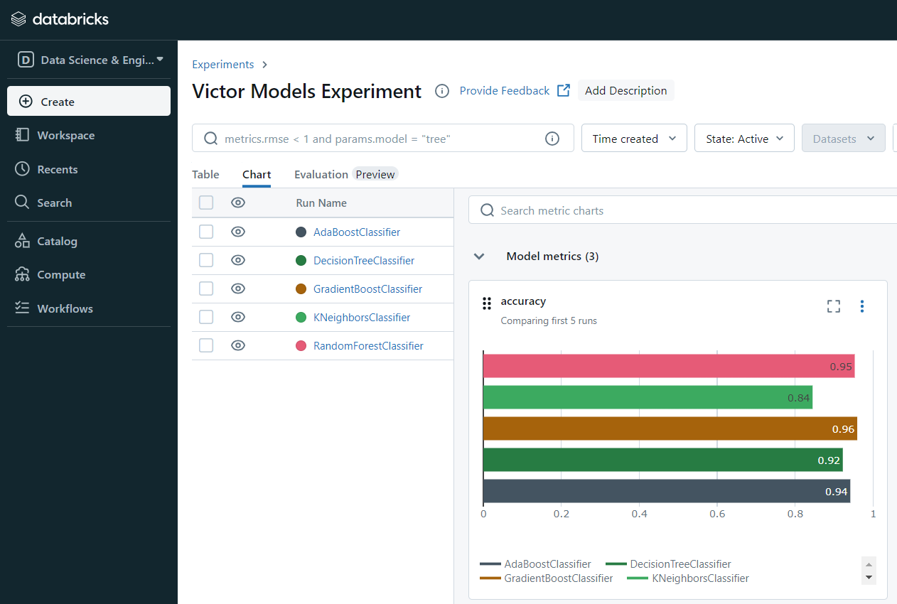

# MLOps with MLflow and Terraform


## 👀 Introduction

This MLOps project started from the customer churn analysis of co-student [CoViktor](https://github.com/CoViktor)

In his project https://github.com/CoViktor/customer_churn_analysis the aim was to find the optimal classification model to trigger an attrition flag for customers at risk. Multiply models were tested for this purpose.

Aim of this repo is to keep track of experiments with one or more models in the MLFlow platform.

## 📦 Project Structure
``` 
├── README.md
├── data
│   └── BankChurners.csv
├── experiments
│   ├── __init__.py
│   └── experiment_random_forest.py
├── models
│   ├── __init__.py
│   └── model_rf.py
├── terraform
│   ├── azure_cloud
│   │   └── main.tf
│   └── local_dockercontainer
│       ├── Dockerfile
│       ├── main.tf
│       ├── requirements.txt
│       └── terraform.tfstate
├── mlflow_on_databricks.ipynb
├── requirements.txt
├── README.md
└── utils
    ├── __init__.py
    ├── data_preprocessing.py
    └── model_utils.py
``` 

## 🚀 Running an experiment on the MLFlow Locally

```bash	
$ mlflow ui
$ python3 experiments/experiment_rf.py
```


## 🚀 Running an experiment on the MLFlow in a docker container (build with Terraform)

From the terraform/local_dockercontainer directory run:

```bash
$ terraform init
```

```bash
$ terraform apply
```

Once the dockercontainer is up and running, run from the root:

```bash
$ python3 experiments/experiment_random_forest.py
```

Experiments are logged in the MLFlow UI running in the dockercontainer.
From the localhost it is accessible at http://localhost:5000


## 🚀 Running an experiment on databricks MLFlow

The ```mlflow_on_databricks.ipynb``` can be used to run an experiment on Databricks. For this Databricks Community Edition is used.




## Metrics

### Accuracy

Accuracy measures the proportion of correctly classified instances out of the total instances. An accuracy of approximately 95.61% indicates that the model correctly classified about 95.61% of the examples in the test set.


### ROC AUC

The ROC AUC (Receiver Operating Characteristic - Area Under Curve) score evaluates the model's ability to distinguish between the positive and negative classes. A ROC AUC score of approximately 0.987 suggests that the model has excellent discrimination ability, meaning it is very good at distinguishing between attrited and existing customers.


### Classification Report


## 📜 Timeline

This project was created in 9 days.
